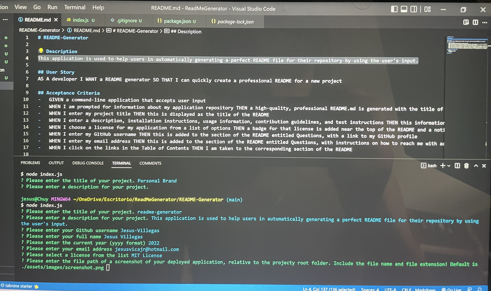

# readme-generator
## Description
This application is used to help users in automatically generating a perfect README file for their repository by using the user's input.

## Acceptance Criteria
-   GIVEN a command-line application that accepts user input
-   WHEN I am prompted for information about my application repository THEN a high-quality, professional README.md is generated with the title of my project and sections entitled Description, Table of Contents, Installation, Usage, License, Contributing, Tests, and Questions
-   WHEN I enter my project title THEN this is displayed as the title of the README
-   WHEN I enter a description, installation instructions, usage information, contribution guidelines, and test instructions THEN this information is added to the sections of the README entitled Description, Installation, Usage, Contributing, and Tests
-   WHEN I choose a license for my application from a list of options THEN a badge for that license is added near the top of the README and a notice is added to the section of the README entitled License that explains which license the application is covered under
-   WHEN I enter my GitHub username THEN this is added to the section of the README entitled Questions, with a link to my GitHub profile
-   WHEN I enter my email address THEN this is added to the section of the README entitled Questions, with instructions on how to reach me with additional questions
-   WHEN I click on the links in the Table of Contents THEN I am taken to the corresponding section of the README

## Technologies/Packages Used
-   NODE.JS
-   inquirer npm package
-   fs package
 
## Table of Contents
- [Installation](#installation)
- [Usage](#usage)
- [License](#license)
- [Credits](#credits)
- [Contributing](#contributing)
- [Tests](#tests)
- [Questions](#questions)
## Installation
Inquirer
## Usage

## License
MIT License 
Copyright (c) 2022 Jesus Villegas
## Credits 

## Contributing
undefined
## Tests

## Questions
For any questions pertaining to this project, the developer can be reached via any of the contact methods listed below. 
Please ensure that you include the name of this project ("readme-generator") in any communications. 
- Email me: jesusvicajr@hotmail.com
- [My Github Profile](https://github.com/Jesus-Villegas?tab=repositories)
## Screenshot of Deployed Application
